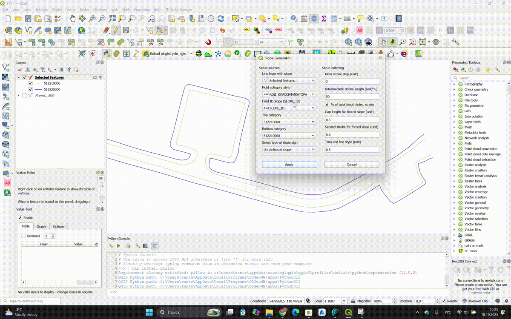

## QGIS Plugin: Slope Generator

This plugin automatically generates slope hachures based on line features that represent the top (crest) and bottom (toe) of a slope. Styling is non-destructive via Geometry Generator; your source data remains unchanged.

### Key features

- **Automatic hachures**: create complex slope symbols in a few clicks.
- **Non-destructive styling**: uses the **Geometry Generator**; source features are not modified.
- **Flexible configuration**: choose the layer, the slope pair ID field, and a categorization field.
- **Percent-based intermediate strokes**: optionally define the first short stroke as a percentage of the full base stroke length; the second short stroke (Forced slope) starts after the first using the same basis when percent mode is enabled.
- **Built-in slope types**: “Unreinforced slope”, “Forced slope”, “Cliff”. You can extend the set.
- **Scale awareness**: stroke lengths and spacing adapt to the current map scale.
- **Quick categorization**: categories are created from a chosen field and colored for convenience.

### Data requirements

1.  **Single line layer**: both crest and toe lines must be stored in the same vector line layer.
2.  **Coordinate system**: The vector layer's coordinate system must be in a UTM projection.
3.  **Categorization field**: an attribute distinguishing crest/toe (e.g., `TYPE` with values `top`/`bottom`, or code values).
4.  **Slope pair ID field**: a unique identifier for the crest–toe pair (e.g., `SLOPE_ID`) so lines can be linked.

Example attribute table:

| id | geometry | TYPE | SLOPE_ID |
| -- | ---------- | -------- | -------- |
| 1 | LineString | top | 101 |
| 2 | LineString | bottom | 101 |
| 3 | LineString | top | 102 |
| 4 | LineString | bottom | 102 |

### Supported slope types

- **Unreinforced slope**: base strokes plus short intermediate strokes.
- **Forced slope**: base strokes plus two series of short strokes with a gap.
- **Cliff**: base strokes only.

Types are implemented with QGIS expressions and applied to the “crest” category, matching it with the “toe” by the pair ID.

### Hachure parameters

All values are interpreted with respect to map scale (expressions use `@map_scale`).

- **Step**: spacing of the main strokes.
- **Intermediate**: length of the first short stroke (Unreinforced/Forced). You can toggle “% of total length inter. stroke” to interpret this as a percentage of the full main stroke (from the feature to the opposite side) instead of fixed map units.
- **Gap**: gap between the first and second short strokes (Forced).
- **Second**: length of the second short stroke (Forced).
- **Trim**: trims the end of the line symbol in map units. Implemented as a data-defined override of the line’s “Trim End” property; helps neatly shorten stroke tips.

### How to use

1.  Prepare your data as per the requirements above.
2.  Open the plugin from the QGIS toolbar (`Slope sign generator`).
3.  Select the slope line layer.
4.  Choose the slope pair ID field (e.g., `SLOPE_ID`).
5.  Select the categorization field (e.g., `TYPE`) — the plugin will create categories and apply a basic style.
6.  Pick the values for the crest and toe categories.
7.  Choose the slope type and set parameters: `Step`, `Intermediate`, `Gap`, `Second`, `Trim`. If needed, enable “% of total length inter. stroke” to express `Intermediate` as a percentage. For “Forced slope”, the second short stroke begins after the first (plus `Gap`) and respects the same percentage basis for the first stroke.
8.  Click “Apply” — the style is appended to the symbol of the selected crest category.

**Notes:**

- Crest and toe category values must differ.
- If the layer is not yet categorized, apply categorization first.

### Installation

1.  Open QGIS (minimum version: 3.0).
2.  Go to `Plugins` → `Manage and Install Plugins...`.
3.  Search for `Slope Generator`.
4.  Install the plugin; the toolbar icon will appear.

Installing from ZIP: `Plugins` → `Install from ZIP`, then select the archive.

### Limitations and tips

- The layer must be line geometry; crest–toe geometries must be linkable via the pair ID.
- Enter numeric values for `Step/Intermediate/Gap/Second/Trim`; the plugin validates input.
- Map scale affects stroke lengths and spacing; verify appearance at target scales.

### Feedback and contribution

- Issues: `https://github.com/santerr80/slope_generator/issues`
- Suggestions and pull requests are welcome.

### License

Distributed under **GNU GPL v2.0 or later**.

### Author

- **santerr80** — `santerr80@gmail.com`

### Changelog

- **0.3.0**: percent-based intermediate strokes option; Block 3 (Forced) now starts from the end of Block 2 using the same basis when percent mode is enabled; documentation updated.
- **0.2.0**: added hachure setup tools, Trim parameter support, updated UI and categorization logic.
